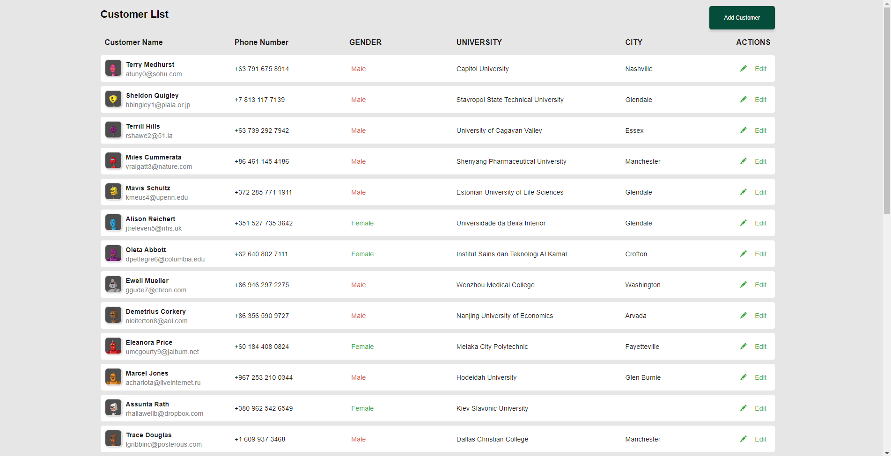
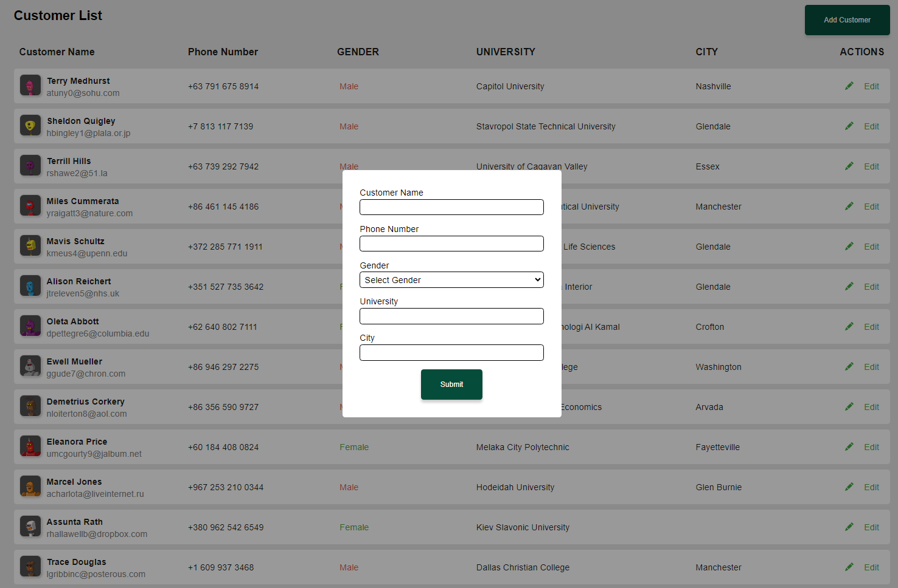
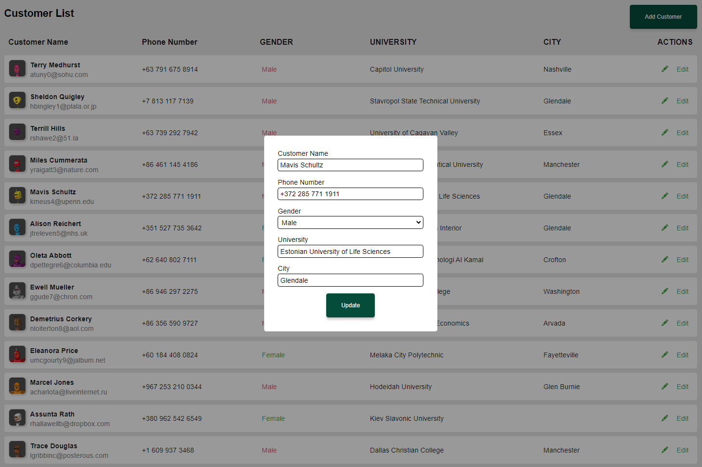

# React Customer Dashboard App Using ReactJs

- Experience efficient customer management with the Customer Dashboard App, leveraging ReactJS to streamline data handling and provide an engaging interface.
- Built on ReactJS, this app simplifies customer management. View, add, and edit customer details seamlessly using props, useState, useEffect, and fetch.
- Enjoy an interactive interface with real-time updates. React-icons enhance the visual appeal, while useEffect keeps data synchronized for a smooth and dynamic user experience.

Live Site Link: https://react-customer-dashboard-app.netlify.app/

## Steps to follow

For using the project, follow the following steps

- Run command `git clone https://github.com/veerprakash28/react-customer-dashboard.git` to clone the git repo in your system
- Locate to the react-movie-insights-app folder: `cd react-customer-dashboard`
- Run command `npm i` to install node_modules
- Run command `npm start` to run the project locally in your system

If everything goes fine then this project will be cloned in your system

## Screenshot

### HomePage

### Add Customer

### Update Customer

